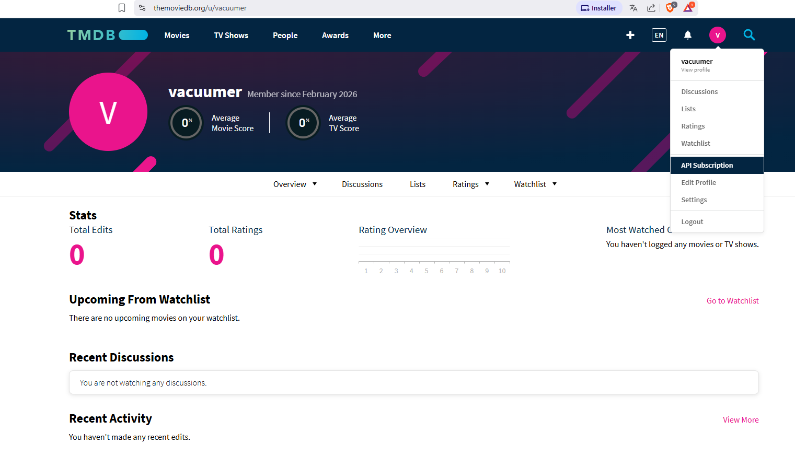

# TMDB MCP Server

## Overview

This project is an MCP (Model Context Protocol) server for The Movie Database (TMDB). It provides a set of tools for searching movies, TV shows, trending content, and fetching reviews and recommendations using the TMDB API.

## Requirements

- Python 3.12+
- [uv](https://github.com/astral-sh/uv)

## Setup

1. **Install dependencies:**
   ```
   uv sync
   ```

2. **Get your TMDB API key:**
   - Go to [TMDB API Subscription](https://www.themoviedb.org/subscription) and sign up or log in.
   - Subscribe to the API and copy your API key (Bearer token).
   - Create a `.env` file in the project root and add:
     ```
     TMDB_API_KEY="<YOUR_API_KEY>"
     ```
  

## Running the Server

Run the server in stdio mode from the root directory:
```
uv run main.py
```

You should see `Starting MCP server...` if everything is set up correctly.

## Claude Desktop Config

To use this server with Claude for Desktop, add it to your `claude_desktop_config.json`:

**Windows Example:**
```
{
  "mcpServers": {
    "tmdb-server": {
      "command": "uv",
      "args": [
        "--directory",
        "C:\\ABSOLUTE\\PATH\\TO\\movies-mcp-server",
        "run",
        "main.py"
      ]
    }
  }
}
```
Replace the path with your own absolute path to the repo.

**MacOS Example:**
```
{
  "mcpServers": {
    "tmdb-server": {
      "command": "/opt/homebrew/bin/uv",
      "args": [
        "--directory",
        "/ABSOLUTE/PATH/TO/movies-mcp-server",
        "run",
        "main.py"
      ]
    }
  }
}
```

## Available Tools

The following tools are available via MCP:

- `tmdb_search_movies`: Search for movies by title, year, region, etc.
- `tmdb_multi_search`: Search for movies, TV shows, and people in a single query.
- `tmdb_trending_search`: Get trending movies, TV shows, and people (daily/weekly).
- `tmdb_tv_recommendations`: Get TV show recommendations for a given series.
- `tmdb_review_details`: Get details for a specific review by review ID.
- `tmdb_movie_reviews`: Get user reviews for a movie.
- `tmdb_tv_reviews`: Get user reviews for a TV show.

All tools return formatted strings for easy reading and integration.

## Development

- All TMDB API logic is in `services.py`.
- MCP tool definitions are in `server.py`.
- Entry point is `main.py`.

## Notes

- This project is not affiliated with TMDB. You must use your own API key.
- For more on MCP, see [Model Context Protocol servers GitHub](https://github.com/modelcontextprotocol/servers?tab=readme-ov-file).